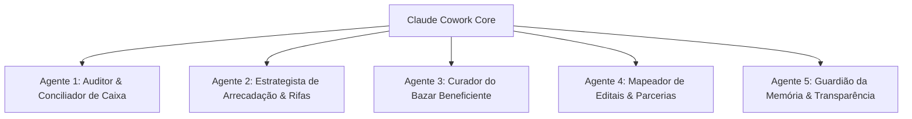

# 📊 Resumo Executivo & Técnico: REUNI Financeiro 2026 (UFBA)

---

## 1. Contexto do Projeto & Diretrizes de Negócio

### 🎯 O que é a REUNI?
A **REUNI (UFBA 2026)** é um projeto de recepção, acolhimento, permanência estudantil, integração universitária e formação cidadã para calouros da Universidade Federal da Bahia. 
- **Princípio Central**: A REUNI é **100% gratuita** para todos os participantes, porém sua execução envolve **custos reais** de estrutura, materiais, comunicação, recreação e logística.

### 💼 O Papel da Subcomissão Financeira (Baseado na Bíblia REUNI - Cap. 6)
A Subcomissão de Financeiro atua como o **garantidor material** da REUNI:
1. **Capital Prévio**: A maior parte dos gastos ocorre *antes* do evento (impressões, materiais de palco, sinalização, brindes), exigindo arrecadação rápida e antecipada.
2. **Diversificação de Receita**: Combinação estratégica de **Rifas** (ex: Kindle, Kit Calouro precificados em até R$ 7,00), **Doações de professores/ex-alunos**, **Parcerias Comerciais**, **Editais de Extensão/UFBA** e **Bazar Beneficiente**.
3. **Visão Tridimensional**:
   - *Curto Prazo*: Garantir demandas iniciais.
   - *Médio Prazo*: Sustentar a execução da edição atual.
   - *Longo Prazo*: Construir memória financeira para fortalecer as edições futuras.

---

## 2. Arquitetura do Sistema & Stack Tecnológica

| Camada | Tecnologia / Solução | Descrição |
| :--- | :--- | :--- |
| **Frontend Framework** | React 19 + Vite | SPA de alta performance com rotas dinâmicas via `react-router-dom` v7. |
| **Estilização & UI** | Tailwind CSS v4 + Framer Motion | Interface refinada com tema escuro/claro, micro-interações fluidas e sistema de cores da marca REUNI. |
| **Iconografia** | Lucide React | Componentes visuais minimalistas e responsivos. |
| **Exportação de Dados** | SheetJS (`xlsx`) | Exportação automática do relatório gerencial consolidado para `.xlsx` e importação de CSV/Excel. |
| **Backend & Servidor** | Node.js Nativo (`server.js`) | HTTP Server rodando 24/7 sem frameworks pesados, com suporte a **SSE (Server-Sent Events)** para sincronização em tempo real multi-dispositivo. |
| **Autenticação & Token** | `REUNI_ACCESS_TOKEN` ("304314") | Variável de ambiente para proteção e autorização das APIs no servidor (PowerShell local: `$env:REUNI_ACCESS_TOKEN = "304314"`; Produção: Configurado no painel do Render). |
| **Persistência Tridimensional** | LocalStorage + JSON DB + SSD 1TB | Arquitetura de resiliência em 3 níveis: 1) `localStorage` no browser; 2) DB local `data/reuni_db.json`; 3) Sincronização automática para SSD Externo (`D:\REUNI_STORAGE`) com histórico de até 50 backups automáticos. |

---

## 3. Estrutura de Módulos da Aplicação (As 7 Seções da Dashboard)

O sistema está organizado em **3 grandes categorias funcionais**:

### 🟦 CATEGORIA 1: CAIXA (Gestão de Custos & Viabilidade)

1. **Visão Geral (`/` - Dashboard)**
   - **Métricas Globais**: Cards com *Saldo Atual*, *Total Arrecadado*, *Total de Gastos*, *Demandas Previstas* e *Meta Geral*.
   - **Visualizações**: Gráficos de barras por subcomissão, barras de progresso por meta e alertas orçamentários.

2. **Gestão de Caixa (`/caixa`)**
   - **Extrato Financeiro**: Registro detalhado de todas as Entradas e Saídas.
   - **Comprovantes Fiscais**: Upload e visualização de notas e recibos (armazenados via API em PDF/Imagem no SSD).
   - **Filtros & Buscas**: Filtro por categoria, tipo de operação e período.

3. **Demandas por Subcomissão (`/demandas`)**
   - **Solicitações de Gastos**: Módulo onde as subcomissões (*Comunicação, Estrutura, Programação, Recreação, Acolhimento*) registram suas necessidades de compra.
   - **Workflow de Aprovação**: Status *Pendente* ➔ *Aprovado* ➔ *Pago*.
   - **Automação**: Ao marcar uma demanda como **"Pago"**, o sistema gera automaticamente uma transação de **Saída** no Caixa.

---

### 🟩 CATEGORIA 2: ENTRADA (Fontes de Receita)

4. **Arrecadação Estratégica (`/arrecadacao`)**
   - **Campanhas de Receita**: Monitoramento de Rifas, Doações Solidárias, Apoios Comerciais e Editais.
   - **Rastreabilidade de Rifas**: Registro de vendas por bilhete, com identificação de *Vendedor*, *Comprador*, *Quantidade de Bilhetes* e *Números Selecionados*.

5. **Curadoria do Bazar (`/bazar`)**
   - **Gestão do Acervo Beneficiente**: Cadastro e precificação de produtos doados.
   - **Status do Item**: *Em Avaliação* ➔ *Disponível no Balcão* ➔ *Vendido*.
   - **Venda em Balcão**: Modal de checkout com valor final, comprador, vendedor responsável e comprovante Pix.

---

### 🟨 CATEGORIA 3: REGISTRO (Patrimônio & Memória Institucional)

6. **Inventário & Patrimônio (`/inventario`)**
   - **Controle de Bens Físicos**: Mapeamento de itens adquiridos ou doados (caixas de som, faixas, sinalização, lonas, materiais de decoração).
   - **Economia Estimada**: Cálculo do valor economizado pelo reuso de materiais de edições passadas.

7. **Prestação & Informações (`/informacoes`)**
   - **Bloco de Notas (Estilo Google Keep)**: Notas com checklist, pins, tags e cores.
   - **Bíblia REUNI 2026**: Diretrizes organizacionais e administrativas do Capítulo 6 fixadas para consulta rápida dos membros.

---

## 4. Modelos de Dados (JSON Database Schemas)

Toda a aplicação opera sob o schema central sincronizado via `server.js`:

```json
{
  "demandas": [
    { "id": "1", "item": "Banner Boas-Vindas", "custo": 150.00, "comissao": "Comunicação", "status": "Pago", "data": "2026-09-10" }
  ],
  "arrecadacoes": [
    { "id": "1", "nome": "Rifa Kindle 2026", "tipo": "Rifa", "meta": 1000.00, "atual": 450.00, "status": "Em Andamento" }
  ],
  "transacoes": [
    { "id": "1", "descricao": "Venda Rifa Kindle (Vendedor: João)", "tipo": "Entrada", "valor": 35.00, "categoria": "Rifa", "comprovanteUrl": "/api/documents/doc_123.pdf", "dataHora": "10/09/2026 14:30" }
  ],
  "bazarItems": [
    { "id": "1", "nome": "Jaqueta Jeans Vintage", "categoria": "Roupas", "precoAvaliado": 45.00, "status": "Vendido", "vendedorBalcao": "Maria" }
  ],
  "inventarioItems": [
    { "id": "1", "nome": "Caixa de Som Portátil JBL", "quantidade": 2, "categoria": "Eletrônicos", "estado": "Excelente", "valorEstimadoEconomizado": 800.00 }
  ],
  "keepNotes": [
    { "id": "1", "titulo": "Ata de Reunião Financeiro", "conteudo": "Alinhamento sobre rifas", "cor": "blue", "isPinned": true }
  ],
  "updatedAt": 1726010000000
}
```

---

## 5. 🤖 Sugestão de Arquitetura de Agentes Inteligentes para o Claude Cowork

Com base nas demandas estratégicas e operacionais do REUNI Financeiro, recomenda-se a criação dos seguintes **Agentes Especiais**:



### 1️⃣ Agente Auditor & Conciliador de Caixa (`financial-audit-agent`)
- **Função**: Auditar notas fiscais, recibos e comprovantes enviados por imagem/PDF.
- **Ações**: Extrair dados de comprovantes via OCR/Visão, validar se o valor bate com o informado na transação, detectar duplicidades e alertar sobre pagamentos pendentes de demandas.

### 2️⃣ Agente Estrategista de Arrecadação & Rifas (`fundraising-strategy-agent`)
- **Função**: Maximizar o engajamento e as vendas das rifas e campanhas.
- **Ações**: Analisar a velocidade de vendas dos bilhetes, sugerir precificação ideal com base no público da UFBA (mantendo a regra dos R$ 7,00), gerar cópias de divulgação para WhatsApp/Instagram e alertar quando uma campanha estiver abaixo da meta.

### 3️⃣ Agente Curador do Bazar Beneficiente (`bazar-curator-agent`)
- **Função**: Gestão inteligente de precificação e inventário do bazar.
- **Ações**: Sugerir preços justos para roupas/itens doados com base na categoria e conservação, gerar descrições atraentes para os itens e sugerir promoções de liquidação para itens parados.

### 4️⃣ Agente Mapeador de Editais & Parcerias (`sponsorship-grant-agent`)
- **Função**: Identificar oportunidades de fomento institucional e patrocínio comercial.
- **Ações**: Ler editais da UFBA/PROEXT (PDFs), extrair requisitos de inscrição e rascunhar propostas comerciais personalizadas para empresas juniores e comércios locais parceiros.

### 5️⃣ Agente Guardião da Memória & Transparência (`governance-reporting-agent`)
- **Função**: Garantir a sustentabilidade de longo prazo da REUNI.
- **Ações**: Gerar relatórios automatizados de prestação de contas (PDF/Markdown/Excel), comparar custos da edição atual com edições passadas e compilar a "Memória de Custos" para a comissão do ano seguinte.

---

### 📌 Resumo para Copiar & Enviar ao Claude Cowork
> "Olá Claude! Este é o resumo completo da estrutura, banco de dados, regras de negócio e arquitetura do **REUNI Financeiro 2026 (UFBA)**. Use este documento para entender todos os módulos (Dashboard, Caixa, Demandas por Subcomissão, Arrecadação, Bazar, Inventário e Notas/Bíblia REUNI) e projetar os Agentes de IA recomendados na Seção 5."
